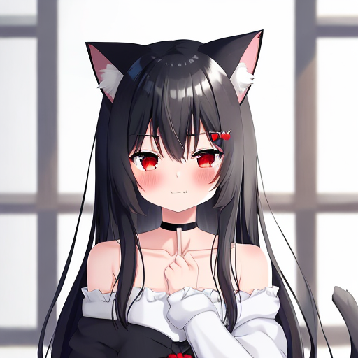

# 🎥 StreamiManga: A Dive into Anime Data, Quizzes, Recommendations, and Creativity! 🎌

Welcome to **StreamiManga**, the ultimate anime hub where data analysis meets creativity! 🚀 Whether you're here to analyze viewing trends, test your anime knowledge, discover tailored anime recommendations, or generate your dream anime character, this app has you covered. 🌟

Access the app [here](https://streamimanga.streamlit.app/).

## 🌟 Features

1. **📊 Who Watches Animes?**  
   Explore anime viewership statistics and trends!  
   - Gender-based analysis of viewers.  
   - Distribution of anime types.  
   - Average scores and popularity insights.  
   - Deep dives into individual anime performance.

2. **🎮 Let's Take a Quiz!**  
   Test your anime character knowledge with our fun quiz.  
   - Choose your favorite anime or go for a mixed bag.  
   - Guess characters based on blurred images and hints.  
   - Track your score and challenge yourself to improve!

3. **🙋🏻‍♀️ Wants Some Recommendations?**  
   Discover your next favorite anime powered by cutting-edge machine learning!  
   - Input your favorite anime.  
   - Get personalized recommendations using genre weighting and similarity analysis.  
   - View essential details like scores, episodes, and genres.

4. **🧚🏼 Generate Your Anime Character!**  
   Bring your anime imagination to life!  
   - Enter a prompt and watch as your dream character appears.  
   - Use state-of-the-art AI for high-quality character generation.  
   - Save and download your creation.

5. **👋 Welcome Dashboard**  
   An intuitive entry point to the app.  
   - Switch between English and Japanese.  
   - Browse trending anime with trailers and user stats.  
   - Get a quick overview of everything StreamiManga offers.


## ⚙️ Methods Used

### 🛠️ Data Analysis and Visualization  
- **Tools**: Streamlit, Pandas, Plotly.  
- **Key Visuals**:  
  - Bar charts for anime type distribution.  
  - Pie charts for gender-based viewer demographics.  

### 🎲 Interactive Quiz  
- **Logic**:  
  - Randomized questions with dynamic image blurring using PIL.  
  - Multiple-choice answers and hints.  
- **Score Tracking**: View results instantly after each question.

### 🔮 AI-Powered Recommendations  
- **Machine Learning Techniques**:  
  - **Feature Engineering**: One-hot encoding and standardization.  
  - **Similarity Analysis**: Locality Sensitive Hashing (LSH) for cosine similarity.  
- **Dynamic Weighting**: Emphasis on matching genres to tailor results.

### 🎨 Character Generation  
- **Model**: `Ojimi/anime-kawai-diffusion` from the Hugging Face hub.  
- **Pipeline**: Diffusion-based generative AI.  
- **Customizable Inputs**: Prompt-based generation with optional negative constraints.

#### 🎨 Example: Anime Character Generation

Here are some examples of anime characters generated using the **StreamiManga** app:

<p align="center">
  
  
</p>

## 🧩 Dependencies

- Python packages (see `requirements.txt`):
  - `streamlit`, `pandas`, `numpy`, `torch`, `diffusers`, `plotly`, `scikit-learn`, etc.
- Java environment for PySpark:
  - `default-jre`, `default-jdk`.


## 📂 Project Structure

```
📂 streamimanga/
├── 📁 images/ 
├── 📁 data/                 # Data files for anime, characters and users
├── 📄 1_📺_Who_Watches_Animes_?.py
├── 📄 2_㉄_Let's_take_a_quiz!.py
├── 📄 3_🙋🏻‍♀️_Wants_Some_Recommandations?.py
├── 📄 4_🧚🏼_Generate_your_anime_character!.py
├── 📄 Welcome.py
├── 📄 requirements.txt
└── 📄 README.md
```

## 📜 License

This project is licensed under the MIT License.

Enjoy exploring the magic of anime! 💖✨  
